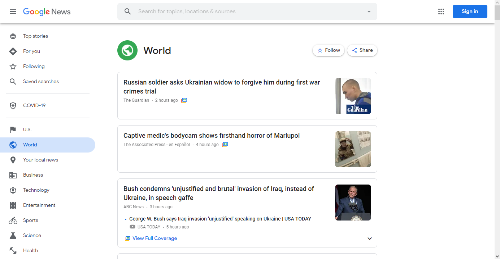
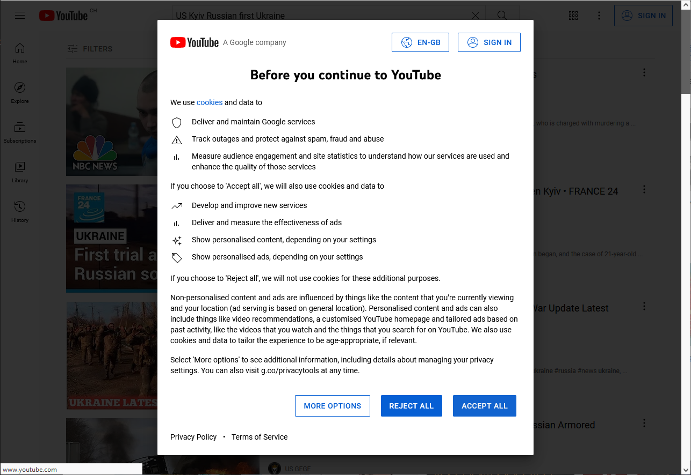
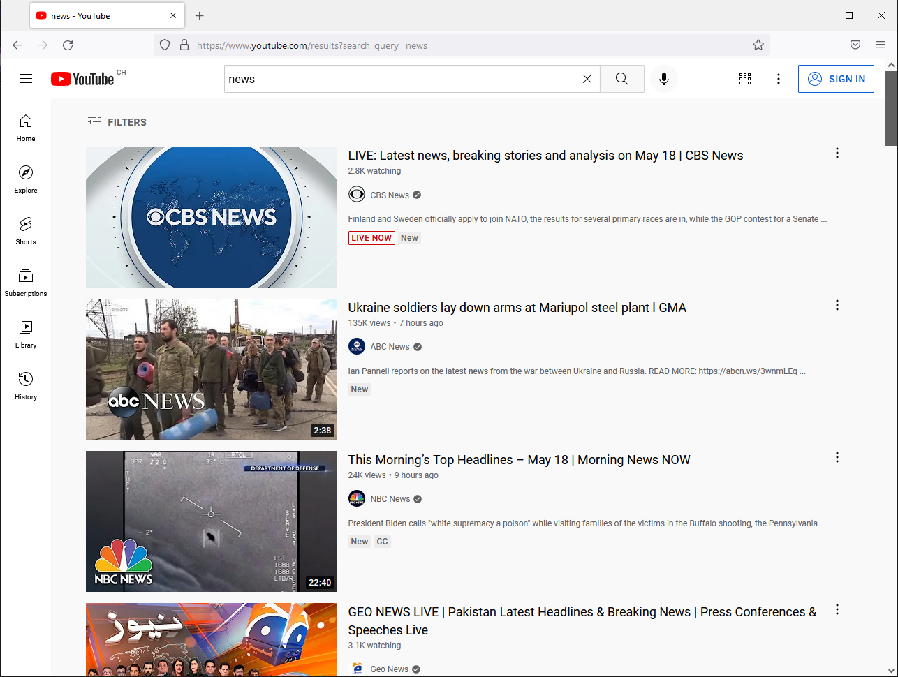
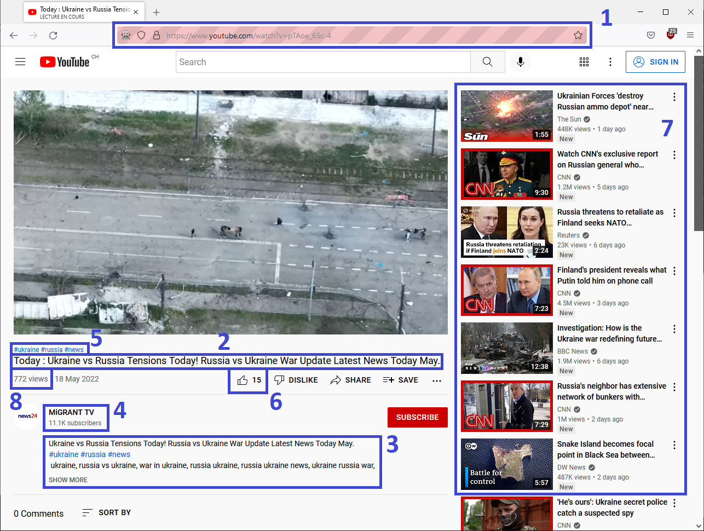

# Instalation

## Firefox
You have to download and install [Firefox Browser](https://www.mozilla.org/fr/firefox/new/)

## Anaconda Prompt (anaconda3)
You have to download and install [Anaconda Prompt](https://www.anaconda.com/).

Once installed start a Anaconda Prompt.

## Conda Environment
We have prepared a conda environment, named `ytcrawler`, with all the Python packages that you might need for the exam. You can install it with the following command:   
`conda env create -f environment.yml`

Once installed, to activate the environment, please use `conda activate ytcrawler`. To use it in Jupyter, please initiate Jupyter from a terminal with ytcrawler as the active conda environment. Alternatively, you can add the conda environment as a custom kernel by using the following command:   
`python -m ipykernel install --user --name=ytcrawler`

## Adblocker
We have prepared a download [script](extensions/firefox/download.sh) for the Adblocker. You just have tu run it.

# Usage

## timer.py
to run the experiment
`python timer.py {ID}`
- where `ID` is the ID of the process.

## reload_data.py
To reload data that where missing for some of the experiment.
`python reload_data.py {path}`
- where `path` is the path to the data, it will creat a new directory `tmp` with the new data.

## merge_data.py
To merge data of the experiment.
`python merge_data.py {path}`
- where `path` is the path to the data, it will creat a new file `all.infos` with all the other  

# How it work to get data

## Get theme
It first opens the browser on [google news](https://news.google.com) on the home page.
Then go on `World` topics.

It first opens the browser on [youtube](https://www.youtube.com) on the home page.

Then click on the `ACCEPT ALL` button, to allow the cookies.
After that the crawler search the theme.

On this page, it select a list of videos depending on the `browser.CRITERIA`.
Then start the videos.

On this page, it get all the data collected `video_link`[1], `title`[2], `description`[3], `channel_title`[4], `channel_link`[4], `keywords`[5], `nb_like`[6], `nb_views`[8], `nb_sub`[4], `video_duration`, `watch_time`.
For the comments, it get top `browser.NB_COMMENTS` of them and gt the data `video_link`, `channel_link`, `channel_name`, `text`, `nb_like`.
After the `video_duration` of the video or the `browser.WATCH_TIME_VIDEOS` it go to the next random video select from the `browser.MAX_VIDEO_POSITION` videos on the right[7].
And do it for at least `browser.MAX_TOTAL_TIME`.
